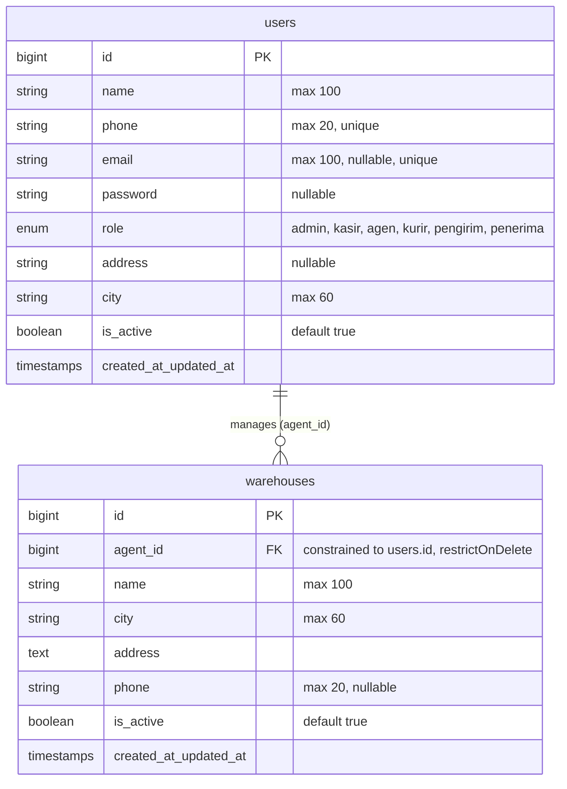

# Layanan Pengguna (Selebret Express - Pengguna)

Dokumentasi komprehensif ini menganalisis arsitektur, spesifikasi kode, aturan bisnis, skema database, dan API endpoint dari **Layanan Pengguna (Selebret Express - Pengguna)** yang dikembangkan menggunakan **Laravel 10**.

## Base URL
*   **Pemberlakuan Lokal**: `http://127.0.0.1:8001`
*   **Port Default**: `8001`

---

# Aturan Umum & Spesifikasi Kode

## 1. Arsitektur & Pola Desain (Penting untuk Developer AI/Manusia)
*   **Arsitektur MVC (Model-View-Controller)**: Proyek ini menggunakan pola Laravel MVC standar dengan fungsionalitas API.
*   **Pola Service**: **TIDAK ADA** layer/folder Service terpisah (`app/Services`). Seluruh logika bisnis (business logic) ditangani langsung di dalam **Controller** masing-masing resource.
*   **Routing API**: Didefinisikan di `routes/api.php` dan berjalan di bawah prefix `/api`.
*   **Penanganan Error Model**: Menggunakan standard exception handler Laravel. Contohnya `findOrFail($id)` akan melempar `ModelNotFoundException` secara default (HTTP 404).

---

## 2. Mekanisme Otentikasi & Otorisasi

Layanan ini diamankan menggunakan middleware kustom bernama **SimpleAuthMiddleware** dengan alias `simple.auth`. Terdapat dua metode otentikasi yang didukung:

### A. Panggilan Antar-Layanan (Internal Service Calls)
Metode bypass otentikasi token untuk komunikasi internal antar-microservices (contoh: Layanan Paket, Layanan Tarif, Layanan Armada, Layanan Pelacakan).
*   **Header**: `X-Service-Key`
*   **Nilai Validasi**: Dibandingkan dengan nilai `env('INTERNAL_SERVICE_KEY')` (fallback default: `'rahasia-internal-ekspedisi-2024'`).
*   **Perilaku**: Jika header cocok, request langsung diteruskan tanpa verifikasi token pengguna atau otorisasi role.

### B. Otentikasi Pengguna (User Session Calls / Frontend)
Digunakan oleh aplikasi frontend (Web/Mobile) untuk pengguna (Admin, Agen, Kurir).
*   **Header**: `Authorization`
*   **Format**: `Bearer <token_base64>`
*   **Metode Pembuatan Token Sederhana**: Token dihasilkan dengan melakukan enkripsi Base64 terhadap format string `"id:role"`.
    *   *Contoh*: User dengan ID `3` dan role `agen` memiliki token `base64_encode("3:agen")` yaitu `MzphZ2Vu`.
    *   *Header*: `Authorization: Bearer MzphZ2Vu`
*   **Proses Validasi**:
    1.  Token didekode untuk mengekstrak `userId` dan `role`.
    2.  Melakukan pencarian ke database: `User::find($userId)`.
    3.  Memastikan user ditemukan dan memiliki status aktif (`is_active` bernilai `true`/`1`). Jika tidak aktif atau tidak ditemukan, kembalikan HTTP 401.
    4.  Jika middleware didefinisikan dengan batasan role (contoh: `simple.auth:admin,agen`), sistem mencocokkan `user->role` dengan parameter role tersebut. Jika tidak cocok, kembalikan HTTP 403.
    5.  Request yang valid akan digabungkan dengan model user melalui `$request->merge(['auth_user' => $user])`.

---

## 3. Struktur Response JSON Standar

Semua endpoint API mengembalikan data dalam format JSON. Berikut adalah format response untuk berbagai kondisi:

### A. Response Sukses
*   **Format Umum (Tanpa Pesan)**:
    ```json
    {
      "status": "success",
      "data": { ... } // atau array [...]
    }
    ```
*   **Format Mutasi (Create / Update / Delete)**:
    ```json
    {
      "status": "success",
      "message": "Pesan deskripsi aksi sukses.",
      "data": { ... }
    }
    ```

### B. Response Gagal (Otentikasi & Otorisasi)
*   **Token Tidak Ditemukan (401 Unauthorized)**:
    ```json
    {
      "status": "error",
      "message": "Unauthorized. Token tidak ditemukan."
    }
    ```
*   **User Tidak Valid / Tidak Aktif (401 Unauthorized)**:
    ```json
    {
      "status": "error",
      "message": "User tidak valid."
    }
    ```
*   **Role Tidak Sesuai (403 Forbidden)**:
    ```json
    {
      "status": "error",
      "message": "Akses ditolak. Role tidak sesuai."
    }
    ```

### C. Response Gagal (Validasi - 422 Unprocessable Entity)
Format validasi ini dihasilkan otomatis oleh Laravel:
```json
{
  "message": "The phone field is required. (and other errors)",
  "errors": {
    "phone": [
      "The phone field is required."
    ]
  }
}
```

### D. Response Gagal (Resource Not Found - 404 Not Found)
*   **Pencarian Berdasarkan Kolom Custom (misal: phone)**:
    ```json
    {
      "status": "error",
      "message": "User dengan nomor HP ini belum terdaftar."
    }
    ```
*   **Laravel ModelNotFoundException (Pencarian `{id}`)**:
    Mengikuti format default framework.

---

## 4. Arsitektur Database (Melalui Migrasi)

Database memiliki dua tabel utama yang saling berelasi:



### A. Tabel `users`
*   **Kolom**:
    *   `id` (BigInt, Primary Key, Auto Increment)
    *   `name` (String, max: 100)
    *   `phone` (String, max: 20, Unique, Indexed)
    *   `email` (String, max: 100, Nullable, Unique)
    *   `password` (String, Nullable) — Hanya diisi untuk role yang bisa login (`admin`, `agen`, `kurir`).
    *   `role` (Enum: `admin`, `kasir`, `agen`, `kurir`, `pengirim`, `penerima`, Indexed)
    *   `address` (String, Nullable)
    *   `city` (String, max: 60, Indexed)
    *   `is_active` (Boolean, Default: `true`, Indexed)
    *   `created_at` & `updated_at` (Timestamps)
*   **Role Spesifikasi**:
    *   `admin`: Akses penuh untuk mengelola pengguna dan gudang.
    *   `kasir`: Petugas kasir.
    *   `agen`: Mitra pengelola wilayah gudang penanggung jawab.
    *   `kurir`: Petugas pengiriman armada barang.
    *   `pengirim`: Pelanggan yang mengirimkan barang (dibuat tanpa password).
    *   `penerima`: Pelanggan penerima barang (dibuat tanpa password).

### B. Tabel `warehouses`
*   **Kolom**:
    *   `id` (BigInt, Primary Key, Auto Increment)
    *   `agent_id` (BigInt, Foreign Key ke `users.id`, Restrict on Delete, Indexed)
    *   `name` (String, max: 100)
    *   `city` (String, max: 60, Indexed)
    *   `address` (Text)
    *   `phone` (String, max: 20, Nullable)
    *   `is_active` (Boolean, Default: `true`, Indexed)
    *   `created_at` & `updated_at` (Timestamps)
*   **Relasi**:
    *   `Warehouse.agent_id` merujuk ke penanggung jawab gudang. Walaupun secara konseptual penanggung jawab adalah user dengan role `agen`, validasi kode di controller dinonaktifkan sehingga `agent_id` secara teknis bisa diarahkan ke user dengan role lain di database.

---

# Endpoint List

## 1. Health Check

### Endpoint
`GET /api/health`

### Keterangan
Melakukan pemeriksaan status dan keaktifan layanan secara publik.

### Request Headers
*Tidak memerlukan otentikasi.*

### Response (200 OK)
```json
{
  "service": "Layanan Pengguna",
  "status": "ok",
  "port": "8001",
  "time": "2026-05-31T07:34:32.000000Z"
}
```

---

## 2. Login

### Endpoint
`POST /api/auth/login`

### Keterangan
Melakukan otentikasi pengguna untuk mendapatkan token. Hanya diperbolehkan untuk role `admin`, `agen`, dan `kurir` yang aktif.

### Request Headers
*Tidak memerlukan otentikasi.*

### Request Body
```json
{
  "phone": "081111111111",
  "password": "admin123"
}
```
*   **Validasi**:
    *   `phone`: `required|string`
    *   `password`: `required|string`

### Response Sukses (200 OK)
```json
{
  "status": "success",
  "data": {
    "token": "MTphZG1pbg==",
    "user": {
      "id": 1,
      "name": "Admin Ekspedisi",
      "role": "admin",
      "city": "Jakarta"
    }
  }
}
```

### Response Gagal (401 Unauthorized)
```json
{
  "status": "error",
  "message": "Nomor HP atau password salah."
}
```

---

## 3. Get Current User Info (Me)

### Endpoint
`GET /api/auth/me`

### Keterangan
Mengambil profil data lengkap pengguna yang sedang aktif/login.

### Request Headers
*   `Authorization: Bearer <token_admin>`

### Otorisasi Middleware
*   `simple.auth:admin` (Hanya Admin)

### Response Sukses (200 OK)
```json
{
  "status": "success",
  "data": {
    "id": 1,
    "name": "Admin Ekspedisi",
    "phone": "081111111111",
    "email": "admin@ekspedisi.com",
    "role": "admin",
    "address": null,
    "city": "Jakarta",
    "is_active": true,
    "created_at": "2026-05-31T07:35:10.000000Z",
    "updated_at": "2026-05-31T07:35:10.000000Z"
  }
}
```

---

## 4. Get User by Phone

### Endpoint
`GET /api/users/phone/{phone}`

### Keterangan
Mencari user aktif berdasarkan nomor HP. Sering dipanggil oleh Layanan Paket (L2) untuk mengidentifikasi detail pengirim/penerima paket.

### Request Headers
*   `Authorization: Bearer <token>` ATAU `X-Service-Key: <internal_key>`

### Otorisasi Middleware
*   `simple.auth` (Semua user terautentikasi atau request internal via Service Key)

### Response Sukses (200 OK)
```json
{
  "status": "success",
  "data": {
    "id": 3,
    "name": "Budi Santoso",
    "phone": "082222222222",
    "email": null,
    "role": "agen",
    "address": "Jl. Mangga Besar No. 10",
    "city": "Jakarta",
    "is_active": true,
    "created_at": "2026-05-31T07:35:10.000000Z",
    "updated_at": "2026-05-31T07:35:10.000000Z"
  }
}
```

### Response Gagal (404 Not Found)
```json
{
  "status": "error",
  "message": "User dengan nomor HP ini belum terdaftar."
}
```

---

## 5. Get User Detail by ID

### Endpoint
`GET /api/users/{id}`

### Keterangan
Mengambil detail informasi user berdasarkan ID. Endpoint ini dipanggil secara internal oleh Layanan Paket (L2), Layanan Armada (L4), dan Layanan Pelacakan (L5).

### Request Headers
*   `Authorization: Bearer <token>` ATAU `X-Service-Key: <internal_key>`

### Otorisasi Middleware
*   `simple.auth` (Semua user terautentikasi atau request internal via Service Key)

### Response Sukses (200 OK)
```json
{
  "status": "success",
  "data": {
    "id": 3,
    "name": "Budi Santoso",
    "phone": "082222222222",
    "email": null,
    "role": "agen",
    "address": "Jl. Mangga Besar No. 10",
    "city": "Jakarta",
    "is_active": true,
    "created_at": "2026-05-31T07:35:10.000000Z",
    "updated_at": "2026-05-31T07:35:10.000000Z"
  }
}
```

---

## 6. List Users

### Endpoint
`GET /api/users`

### Keterangan
Mengambil daftar seluruh user terdaftar. Dapat difilter berdasarkan role, kota, dan pencarian teks bebas.

### Request Headers
*   `Authorization: Bearer <token>`

### Otorisasi Middleware
*   `simple.auth:admin,agen` (Admin & Agen)

### Query Parameters
*   `role` (String, Optional) — Filter role (contoh: `kurir`, `pengirim`).
*   `city` (String, Optional) — Filter kota (contoh: `Jakarta`).
*   `search` (String, Optional) — Pencarian text bebas yang dicocokkan dengan kolom `name` atau `phone` menggunakan SQL `LIKE %search%`.

### Response Sukses (200 OK)
```json
{
  "status": "success",
  "data": [
    {
      "id": 5,
      "name": "Dodi Kuswara",
      "phone": "084444444444",
      "email": null,
      "role": "kurir",
      "address": null,
      "city": "Jakarta",
      "is_active": true,
      "created_at": "2026-05-31T07:35:10.000000Z",
      "updated_at": "2026-05-31T07:35:10.000000Z"
    }
  ]
}
```

---

## 7. Create User

### Endpoint
`POST /api/users`

### Keterangan
Mendaftarkan pengguna baru ke sistem.
*   **Admin**: Dapat mendaftarkan Agen/Kurir/Admin (membutuhkan password).
*   **Agen**: Dapat mendaftarkan Pengirim/Penerima (tidak membutuhkan password).

### Request Headers
*   `Authorization: Bearer <token>`

### Otorisasi Middleware
*   `simple.auth:admin,agen` (Admin & Agen)

### Request Body (Pengguna dengan Password - e.g., Admin, Agen, Kurir)
```json
{
  "name": "Dodi Kuswara",
  "phone": "084444444444",
  "email": "dodi@ekspedisi.com",
  "password": "kurirpassword",
  "role": "kurir",
  "address": "Jl. Gajah Mada No. 1",
  "city": "Jakarta"
}
```

### Request Body (Pengguna tanpa Password - e.g., Pengirim, Penerima)
```json
{
  "name": "Pelanggan Anto",
  "phone": "089999999999",
  "role": "pengirim",
  "address": "Jl. Kemang Raya No. 15",
  "city": "Jakarta"
}
```
*   **Validasi**:
    *   `name`: `required|string|max:100`
    *   `phone`: `required|string|max:20|unique:users,phone`
    *   `email`: `nullable|email|unique:users,email`
    *   `password`: `required|string|min:6` jika `role` adalah `admin`, `agen`, atau `kurir`. Bernilai `nullable` untuk role lainnya.
    *   `role`: `required|string`
    *   `address`: `nullable|string`
    *   `city`: `required|string|max:60`

### Response Sukses (201 Created)
```json
{
  "status": "success",
  "message": "User berhasil didaftarkan.",
  "data": {
    "id": 8,
    "name": "Pelanggan Anto",
    "phone": "089999999999",
    "email": null,
    "role": "pengirim",
    "address": "Jl. Kemang Raya No. 15",
    "city": "Jakarta",
    "is_active": true,
    "created_at": "2026-05-31T14:40:00.000000Z",
    "updated_at": "2026-05-31T14:40:00.000000Z"
  }
}
```

---

## 8. Update User

### Endpoint
`PUT /api/users/{id}`

### Keterangan
Mengubah data detail profil pengguna berdasarkan ID.

### Request Headers
*   `Authorization: Bearer <token_admin>`

### Otorisasi Middleware
*   `simple.auth:admin` (Hanya Admin)

### Request Body
```json
{
  "name": "Budi Santoso Wibowo",
  "email": "budi.santoso@gmail.com",
  "address": "Jl. Mangga Besar No. 10B",
  "city": "Jakarta",
  "phone": "082222222222",
  "is_active": true
}
```
*   **Validasi**:
    *   `name`: `sometimes|string|max:100`
    *   `email`: `sometimes|nullable|email|unique:users,email,{id}`
    *   `address`: `sometimes|nullable|string`
    *   `city`: `sometimes|string|max:60`
    *   `phone`: `sometimes|string|unique:users,phone,{id}`
    *   `is_active`: `sometimes|boolean`

### Response Sukses (200 OK)
```json
{
  "status": "success",
  "message": "Data user berhasil diupdate.",
  "data": {
    "id": 3,
    "name": "Budi Santoso Wibowo",
    "phone": "082222222222",
    "email": "budi.santoso@gmail.com",
    "role": "agen",
    "address": "Jl. Mangga Besar No. 10B",
    "city": "Jakarta",
    "is_active": true,
    "created_at": "2026-05-31T07:35:10.000000Z",
    "updated_at": "2026-05-31T14:42:00.000000Z"
  }
}
```

---

## 9. Update Password User

### Endpoint
`PATCH /api/users/{id}/password`

### Keterangan
Mengubah password kredensial login dari pengguna tertentu berdasarkan ID.

### Request Headers
*   `Authorization: Bearer <token_admin>`

### Otorisasi Middleware
*   `simple.auth:admin` (Hanya Admin)

### Request Body
```json
{
  "password": "newsecurepassword123"
}
```
*   **Validasi**:
    *   `password`: `required|string|min:6`

### Response Sukses (200 OK)
```json
{
  "status": "success",
  "message": "Password berhasil diubah."
}
```

---

## 10. Delete User (Hard Delete)

### Endpoint
`DELETE /api/users/{id}`

### Keterangan
Menghapus baris data pengguna secara permanen (keras) dari database berdasarkan ID.
*   **Catatan**: Walaupun pesan response menyatakan "User dinonaktifkan", implementasi kode sebenarnya memanggil `$user->delete()` yang menghapus data baris secara keras (Hard Delete).

### Request Headers
*   `Authorization: Bearer <token_admin>`

### Otorisasi Middleware
*   `simple.auth:admin` (Hanya Admin)

### Response Sukses (200 OK)
```json
{
  "status": "success",
  "message": "User dinonaktifkan."
}
```

---

## 11. List Warehouses

### Endpoint
`GET /api/warehouses`

### Keterangan
Mengambil daftar seluruh gudang ekspedisi beserta informasi agen penanggung jawabnya.

### Request Headers
*   `Authorization: Bearer <token>` ATAU `X-Service-Key: <internal_key>`

### Otorisasi Middleware
*   `simple.auth` (Semua user terautentikasi atau request internal via Service Key)

### Query Parameters
*   `city` (String, Optional) — Filter gudang berdasarkan kota lokasi.
*   `agent_id` (BigInt, Optional) — Filter gudang berdasarkan ID Agen penanggung jawab.

### Response Sukses (200 OK)
```json
{
  "status": "success",
  "data": [
    {
      "id": 1,
      "agent_id": 3,
      "name": "Gudang Jakarta Barat",
      "city": "Jakarta",
      "address": "Jl. Mangga Besar No. 10, Jakarta Barat",
      "phone": "02155550001",
      "is_active": true,
      "created_at": "2026-05-31T07:35:15.000000Z",
      "updated_at": "2026-05-31T07:35:15.000000Z",
      "agent": {
        "id": 3,
        "name": "Budi Santoso",
        "phone": "082222222222"
      }
    }
  ]
}
```

---

## 12. Get Warehouse Detail by ID

### Endpoint
`GET /api/warehouses/{id}`

### Keterangan
Mengambil detail data gudang beserta profil agen penanggung jawab berdasarkan ID. Dipanggil oleh Layanan Paket (L2) saat pembuatan resi.

### Request Headers
*   `Authorization: Bearer <token>` ATAU `X-Service-Key: <internal_key>`

### Otorisasi Middleware
*   `simple.auth` (Semua user terautentikasi atau request internal via Service Key)

### Response Sukses (200 OK)
```json
{
  "status": "success",
  "data": {
    "id": 1,
    "agent_id": 3,
    "name": "Gudang Jakarta Barat",
    "city": "Jakarta",
    "address": "Jl. Mangga Besar No. 10, Jakarta Barat",
    "phone": "02155550001",
    "is_active": true,
    "created_at": "2026-05-31T07:35:15.000000Z",
    "updated_at": "2026-05-31T07:35:15.000000Z",
    "agent": {
      "id": 3,
      "name": "Budi Santoso",
      "phone": "082222222222",
      "city": "Jakarta"
    }
  }
}
```

---

## 13. Create Warehouse

### Endpoint
`POST /api/warehouses`

### Keterangan
Mendaftarkan gudang ekspedisi baru ke dalam sistem.

### Request Headers
*   `Authorization: Bearer <token_admin>`

### Otorisasi Middleware
*   `simple.auth:admin` (Hanya Admin)

### Request Body
```json
{
  "agent_id": 4,
  "name": "Gudang Bandung Utara",
  "city": "Bandung",
  "address": "Jl. Dago No. 100, Bandung",
  "phone": "02255551234"
}
```
*   **Validasi**:
    *   `agent_id`: `required|exists:users,id` (Catatan: Validasi role agen dinonaktifkan di kode controller).
    *   `name`: `required|string|max:100`
    *   `city`: `required|string|max:60`
    *   `address`: `required|string`
    *   `phone`: `nullable|string|max:20`

### Response Sukses (201 Created)
```json
{
  "status": "success",
  "message": "Gudang berhasil didaftarkan.",
  "data": {
    "id": 3,
    "agent_id": 4,
    "name": "Gudang Bandung Utara",
    "city": "Bandung",
    "address": "Jl. Dago No. 100, Bandung",
    "phone": "02255551234",
    "is_active": true,
    "created_at": "2026-05-31T14:45:00.000000Z",
    "updated_at": "2026-05-31T14:45:00.000000Z",
    "agent": {
      "id": 4,
      "name": "Siti Rahayu"
    }
  }
}
```

---

## 14. Update Warehouse

### Endpoint
`PUT /api/warehouses/{id}`

### Keterangan
Mengubah data detail informasi gudang berdasarkan ID.

### Request Headers
*   `Authorization: Bearer <token_admin>`

### Otorisasi Middleware
*   `simple.auth:admin` (Hanya Admin)

### Request Body
```json
{
  "name": "Gudang Bandung Utara Perubahan",
  "city": "Bandung",
  "address": "Jl. Dago No. 100A, Bandung",
  "phone": "02255559999",
  "is_active": true
}
```
*   **Validasi**:
    *   `name`: `sometimes|string|max:100`
    *   `city`: `sometimes|string|max:60`
    *   `address`: `sometimes|string`
    *   `phone`: `sometimes|nullable|string|max:20`
    *   `is_active`: `sometimes|boolean`

### Response Sukses (200 OK)
```json
{
  "status": "success",
  "message": "Data gudang berhasil diupdate.",
  "data": {
    "id": 3,
    "agent_id": 4,
    "name": "Gudang Bandung Utara Perubahan",
    "city": "Bandung",
    "address": "Jl. Dago No. 100A, Bandung",
    "phone": "02255559999",
    "is_active": true,
    "created_at": "2026-05-31T14:45:00.000000Z",
    "updated_at": "2026-05-31T14:46:00.000000Z",
    "agent": {
      "id": 4,
      "name": "Siti Rahayu"
    }
  }
}
```

---

## 15. Delete Warehouse (Hard Delete)

### Endpoint
`DELETE /api/warehouses/{id}`

### Keterangan
Menghapus baris data gudang secara permanen (keras) dari database berdasarkan ID.
*   **Catatan**: Walaupun pesan response menyatakan "Gudang dinonaktifkan", implementasi kode sebenarnya memanggil `$warehouse->delete()` yang menghapus data baris secara keras (Hard Delete).

### Request Headers
*   `Authorization: Bearer <token_admin>`

### Otorisasi Middleware
*   `simple.auth:admin` (Hanya Admin)

### Response Sukses (200 OK)
```json
{
  "status": "success",
  "message": "Gudang dinonaktifkan."
}
```
